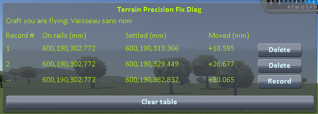

# Terrain Precision Fix - Diagnostic Mod 1

**How this was made.** Written with Claude, Anthropic's AI assistant, and reviewed line by line by a
human — me. I am saying so before anything else, because contributions made with an AI deserve a closer
look than others, and because some people would rather stop reading here. This mod measures and fixes
nothing, so what there is to check is the reading itself: the source is public, and the protocol below
runs on a stock install, on your own craft, against the figures on this page.

A measuring instrument for KSP 1.12, and the first of a small family of them. It lets you check, on
your own install, a claim about the ground your craft is parked on:

> **The ground KSP builds under you is never built at the same height twice.** Load the same save five
> times, and the surface your craft is standing on comes back a little higher or a little lower each
> time — a few centimetres apart on Kerbin, less on smaller worlds.

## Why it matters

Every time you load, it is a coin toss between two outcomes.

**The ground comes back lower than it was when you saved.** Your craft is now hovering a couple of
centimetres above it, so it drops those two centimetres. You never notice, and nothing breaks.

**The ground comes back higher than it was when you saved.** Your craft is now *inside* the ground —
and the physics engine will not leave two solid things overlapping. It pushes them apart, hard, in
the only direction available: up. Your craft gets launched.

That second case is the symptom everybody already knows. The lander that twitches, hops or flips the
moment the scene finishes loading. The base that sat perfectly flush yesterday and is buried up to
the hatches today. The big base that tears itself apart the very first time you load it, and never
again afterwards. A craft with many parts spread over a wide area gives the coin toss more chances
to land the wrong way up.

### Disclaimer: it is not the only cause

The ground moving is one cause among several, and this page does not claim it is the only one. Plenty
of other things move a craft when a scene opens. Two well-known examples, among others:

- **suspensions.** Landing legs and wheels come back fully extended, because that is the only state
  KSP can restore them to. They then compress under the weight of the craft, and the craft moves
  while they do.
- **a craft bent to fit the ground.** While you play, physics twists the joints between parts so the
  craft settles onto the shape of the ground beneath it. That twisting is not saved. On loading, the
  craft comes back in its original, unbent shape — and if the ground is not flat, part of it really
  *is* underground, with no measurement error involved.

Both of those are avoidable, and that is exactly why the test below uses a single capsule with no
legs and no wheels, on flat ground: it takes them out of the picture, along with anything else that
needs a suspension, several parts, or a slope to happen.

## This mod's demonstration

You cannot look at the ground and see this: the surface you walk on and the surface you see are one
and the same, so the picture shifts along with it. What you can see is what rests *on* the ground. So
the mod measures the distance from your craft to the centre of the body, in millimetres, and records
two values for every loading:

- **on rails**, the instant the scene opens, before physics has run — the position the save gives
  back;
- **settled**, once the craft has come to rest on the ground (every frame).

Both are the same measurement, taken between the origin of the root part of the craft — the very
point KSP writes to the save and hands back on loading — and the centre of the body, in double
precision from end to end:

```csharp
private static double DistanceToCentreMm(Vessel vessel)
{
    // Vector3d on both sides, deliberately: reading a few millimetres out of six hundred
    // kilometres leaves no room for anything short of double precision.
    Vector3d toCentre = (Vector3d)vessel.vesselTransform.position - vessel.mainBody.position;
    return toCentre.magnitude * 1000.0;
}
```

Reload the same save several times, then read the two columns against each other. The first one tells
you whether KSP puts the craft back where it was; the second one tells you where it actually came to
rest. As long as neither of them varies from one loading to the next, the round trip is exact and
nothing about the craft itself has changed. One of them does vary, though — spoiler: the second one.

## The measurements

Every reading on this page was taken on a **stock install**, with nothing added to `GameData` but
this mod. There is no mod conflict to look for and nothing to uninstall: this is what KSP does on its
own. Most players do have [KSP Community Fixes](https://github.com/KSPModdingLibs/KSPCommunityFixes)
installed, so the whole campaign was run a second time in an install that has it — same worlds, same
craft, same protocol. It changes nothing: the spread is of the same order on every world. Those
screenshots are in [`imgs/kspcf`](imgs/kspcf) if you want to see them, but the tables below stay on
the stock readings on purpose: a measurement meant to show what bare KSP does is worth more taken
where nothing else is installed.

### One capsule

That is the whole demonstration, and it fits in one screenshot. Here is the same save, on the flat
grass just off the end of the runway, loaded six times:


(The bottom line is the loading in progress, not a seventh one: after the sixth *Record*, it keeps
showing that same sixth loading, still live. It carries `--` instead of a number, since it is not a
record until you freeze it. The screenshots on this page were taken before it did, and still show a
number there.)

The same value in **On rails**, six times over: KSP handed the capsule back in exactly the same
place, every single time. Never a zero in **Moved**: on all six, the ground turned out to be
somewhere else. Sometimes lower, and the capsule dropped onto it; sometimes higher, and it got pushed
back out.

The same lone capsule, the same loadings of one save, done again on the Mun, on Minmus and on
Gilly — the smallest place there is to stand on:


| loading | Kerbin — **Moved** (mm) | Mun — **Moved** (mm) | Minmus — **Moved** (mm) | Gilly — **Moved** (mm) |
|---|---|---|---|---|
| 1 | −3.864 | −3.911 | +1.938 | −0.399 |
| 2 | −20.061 | +4.657 | +0.964 | +0.281 |
| 3 | +58.552 | −1.833 | +0.306 | −0.878 |
| 4 | −76.903 | −1.916 | −0.655 | −0.226 |
| 5 | +25.407 | −13.460 | +3.198 | +0.120 |
| 6 | +22.422 | +4.318 | −0.047 | −0.192 |
| **lowest to highest** | **135.5 mm** | **18.1 mm** | **3.9 mm** | **1.2 mm** |

**On rails** gives the same digits on every line of a series, and you do not have to take the probe's
word for it. It is exactly the radius of the body plus the altitude the save file records for the
craft — the `alt` line of its `VESSEL` node in the `.sfs`:

| world | radius | `alt` in the save | radius + `alt` | **On rails** |
|---|---|---|---|---|
| Kerbin | 600,000 m | 65.240040919510648 m | 600,065,240.041 mm | 600,065,240.041 mm |
| Mun | 200,000 m | 4124.8295934277121 m | 204,124,829.593 mm | 204,124,829.593 mm |
| Minmus | 60,000 m | 0.389444850567088 m | 60,000,389.445 mm | 60,000,389.445 mm |
| Gilly | 13,000 m | 2908.093310114733 m | 15,908,093.310 mm | 15,908,093.310 mm |

So on every world KSP handed the capsule back exactly where the save says it was, and on every world
it still came to rest at a height that changed from one loading to the next.

### The same craft, with two parts

A craft made of a single part is a special case for KSP (see the protocol below). So the whole
campaign was run again with a two-part craft: the same capsule, sitting on a small flat fuel tank.


| loading | Kerbin — **Moved** (mm) | Mun — **Moved** (mm) | Minmus — **Moved** (mm) | Gilly — **Moved** (mm) |
|---|---|---|---|---|
| 1 | −48.444 | +31.739 | +2.345 | −0.401 |
| 2 | −10.198 | −2.391 | −1.685 | +1.267 |
| 3 | +55.878 | +25.500 | +0.343 | −0.596 |
| 4 | −12.615 | −0.359 | +5.605 | +1.699 |
| 5 | +31.578 | −11.701 | −0.336 | +1.444 |
| 6 | −74.071 | −6.996 | | +1.031 |
| **lowest to highest** | **129.9 mm** | **43.4 mm** | **7.3 mm** | **2.3 mm** |

**On rails** again matched the radius of the body plus the `alt` of the save, to the last digit, on
all four worlds. One part or two, the picture is the same.

## What this instrument shows, and what it does not

Every table above measures the **craft**: a craft set down on the ground does not come back to rest
where the save left it, one loading to the next. That is what the instrument sees, and that is where
it stops. It does not, on its own, name what moved. A ground rebuilt a little higher or a little lower
on every loading accounts for the figures — but so would a perfectly steady ground with the craft set
down beside it, off by a rounding error shared by the placement and by the **On rails** reading, where
it would cancel out. Both fill the same table.

A second instrument,
[Terrain Precision Fix Diag 2](https://github.com/lhervier/KSP-TerrainPrecisionFixDiag2), tells the
two apart: it measures **the ground** itself — the height of the surface your craft is touching,
against the height the game computes for that same spot — with no craft in the picture at all. You do
not need it to follow this page.

## Get it

Either way you end up with the same `GameData/TerrainPrecisionFixDiagMod/` folder.

**Download it** — from the assets of the
[latest release](https://github.com/lhervier/KSP-TerrainPrecisionFixDiag/releases/latest).

**Or compile it** — clone this repository, set `KSPDIR` to your KSP install folder and run
`build.bat`. It needs the .NET SDK, takes a few seconds, reads the KSP assemblies straight from
your install, and puts the DLL in `GameData/TerrainPrecisionFixDiagMod/` inside the repository. It
does not install anything. Worth doing if you would rather not run a binary you have no source for
while reporting a measurement.

## Install

Drop `GameData/TerrainPrecisionFixDiagMod` into the `GameData` of KSP, so that you end up with
`GameData/TerrainPrecisionFixDiagMod/TerrainPrecisionFixDiagMod.dll`. It runs on a stock install.

## The window

In flight, a window shows a table with one line per loading, in millimetres. The **bottom line is the
loading in progress**: its numbers move as you watch, it carries `--` where the others carry a record
number, and the *Record* button at the end of it freezes it into the table. The table survives scene
changes, so the lines pile up as you reload.



| column | meaning |
|---|---|
| **On rails** | read the instant the scene opens, before physics has started — the position the game gives to the craft at startup |
| **Settled** | the distance right now, running live until you press the button — so, once the craft has come to rest |
| **Moved** | **Settled** minus **On rails** — how far the craft ended up from the position it was given, this loading. Negative means it went down |

**Moved** is the figure to look at, and it should be zero. The craft was at rest on the ground when
you saved it; handed back at that very height, it has no reason to move at all.

Its sign says which of the two outcomes above you got — and how much the figure is worth.

**Negative** — the craft came back above the surface it ends up resting on, and dropped onto it. That
is a clean measurement: the figure is the gap it fell through.

**Positive** — the craft came back below that surface, so it started off inside it and the physics
pushed it back out. Still a craft that did not stay where it was put, but the figure itself is
spoiled: it measures how hard it was shoved, not how deep it started.

Watch the live line as the craft settles and you see the demonstration play out: while the craft is
still on rails the two distances are equal and **Moved** reads `0.000`, and it is the first step of
physics that breaks the zero.

Every frozen line carries a *Delete* button, so a line recorded too early — before the craft had
finished settling — costs one click to throw away. *Clear table* throws away the lot. The table lives
in memory only, and empties itself when KSP is closed.

## The protocol

**1. Launch a capsule on its own** — no anchor, no wheels, no landing legs, nothing attached.


(The probe window is draggable — drop it wherever it does not get in the way.)

**2. Move it off onto bare ground.** `Alt+F12 → Cheats → Set Position`. Tick *Use middle click to set
position*, then middle-click a patch of grass just off the end of the runway. No need to go far — the
KSC apron is conveniently flat — but you do have to be off the tarmac itself.


⚠️ **Not on the launchpad and not on the runway.** It works there too — the numbers move just the
same. The trouble is that they no longer say what moved. The launchpad and the runway are structures,
not ground: KSP puts them in place its own way, and their height may well have a wobble of its own.
A reading taken there is the sum of two effects and tells you nothing about either. On bare terrain
there is only one thing under the capsule.

⚠️ **And the ground must be flat.** A craft made of a single part is a special case for KSP: on every
loading, it tries to put the craft back onto the ground itself. On flat ground this does nothing,
and the capsule is left exactly where the save put it. On a slope KSP moves it, and the
reading then mixes that move with the ground's. You can tell from `KSP.log`: a line
`ground contact! - error. Moving Vessel` naming your capsule, right before `Unpacking`. If you get
that line, find flatter ground.

⚠️ **And the capsule must not slide.** On a slope, even one gentle enough not to produce that line,
the capsule can slide slowly downhill, and its height goes down as it slides. On a world with little
gravity like Gilly, a slope you can barely see is enough, at a fraction of a millimetre per second.
**Settled** then never stops moving, and **Moved** only tells you how long you waited before pressing
*Record*. So a spot is only good if both hold: no `Moving Vessel` line in `KSP.log`, and a **Settled**
value that stops moving once the capsule has come to rest.

**3. Let it settle, and save once.**


If you pressed *Record* before saving — out of curiosity, while placing the capsule — delete that
line now. It was taken before the save existed, so its **On rails** value is the launch position and
does not belong in the same column as the others.

**4. Load that same save.**


**5. Watch the live line until it stops moving, then press *Record* at the end of it.**


The first line appears. **On rails** is the height the save gave back, **Settled** the height the
capsule actually came to rest at, and **Moved** the difference — already not zero.


**6. Load the same save again.** Not a new save: the one from step 3, again.


**7. Settle, record again.** A second line appears, under the first.


**8. Repeat steps 6 and 7** until you have five or six lines.


⚠️ **Never save again until the campaign is over.** Saving each time would write a new position every
time, and you would be measuring your own round trip on top of the ground.

Now read the table. If there were nothing wrong, it would read like this: **On rails** the same value
on every line — KSP handing the capsule back exactly where it left it, loading after loading — and
**Moved** zero on every line, because the capsule was set down on the ground and has nothing left to
do.

Half of that holds. **On rails** comes back to within a thousandth of a millimetre, so the save and
reload round trip is exact and the capsule really is put back where it was. **Moved** is not zero on
a single line, and it is not small either.

## License

MIT
