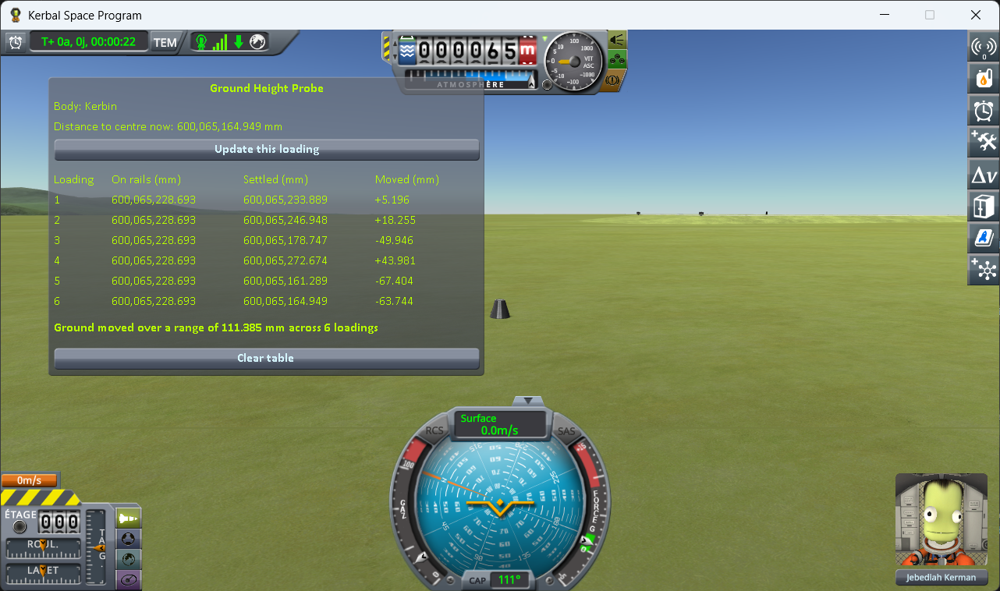
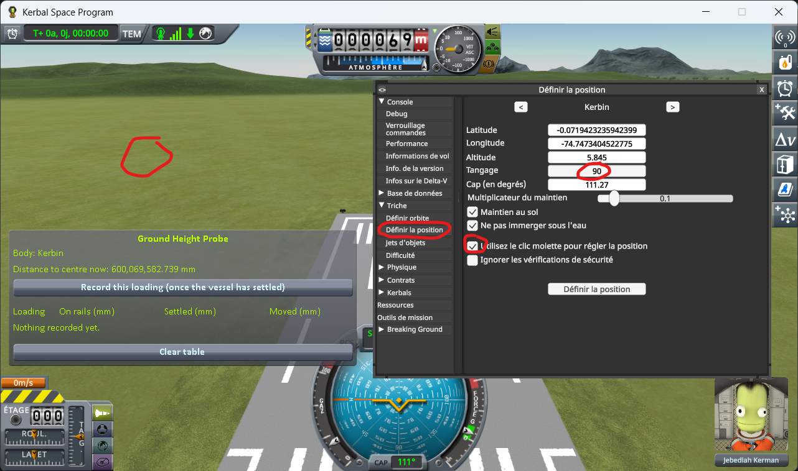
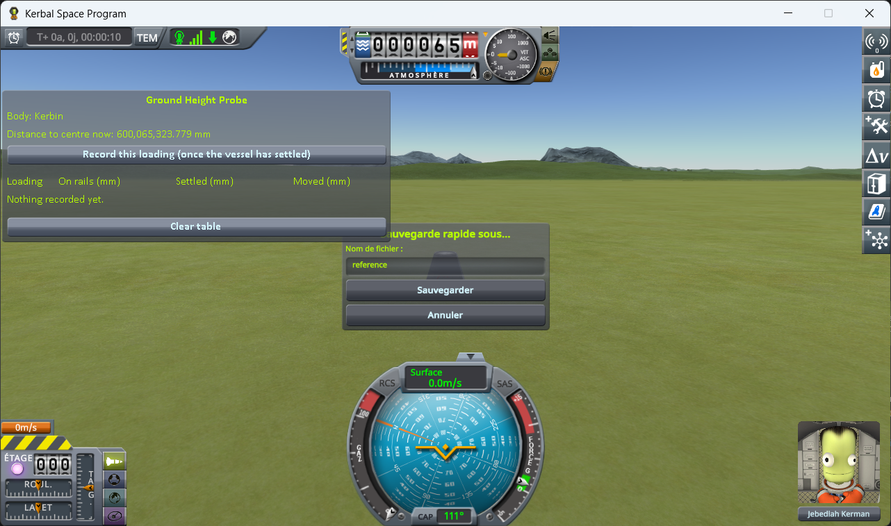
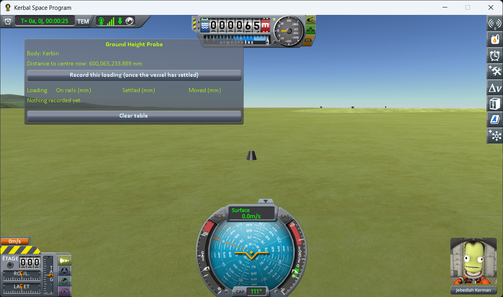
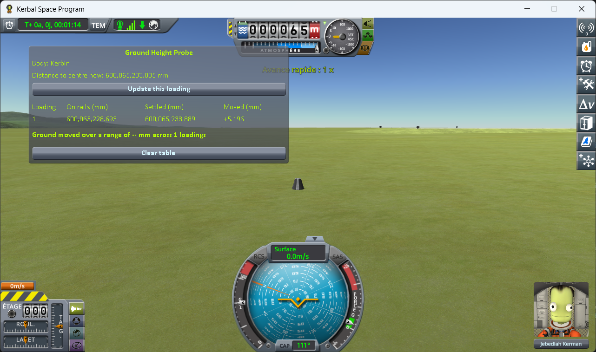
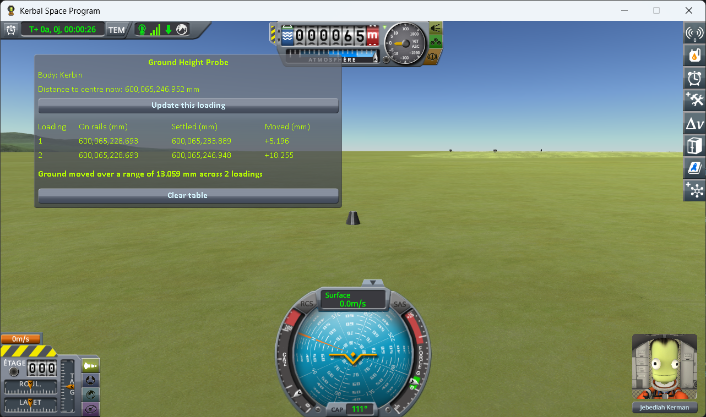

# Ground Height Probe

A measuring instrument for KSP 1.12. It lets you check, on your own install, a claim about the ground
your craft is parked on:

> **The ground is never twice at the same height.** Reload the same save five times, and the terrain
> your craft rests on is somewhere slightly different each time — a few centimetres apart on Kerbin.

You cannot look at the ground and see this: the surface you walk on and the surface you see are one
and the same, so the picture shifts along with it. What you can see is what rests *on* the ground. So
the mod measures the distance from your craft to the centre of the body, in millimetres, and records
two values for every loading:

- **on rails**, the instant the scene opens, before physics has run — the position the save gives
  back;
- **settled**, once the craft has come to rest on the ground.

Reload the same save several times, then read the two columns against each other. The first one tells
you whether KSP puts the craft back where it was: as long as it does not vary, the save and reload
round trip is exact and nothing about the craft itself has changed. If the second one varies anyway,
then the craft was put down in the same place every time and still came to rest somewhere else — and
the only thing left that can have moved is the ground it landed on.

That is the whole demonstration, and it fits in one screenshot. Here is the same save, on the flat
grass just off the end of the runway, loaded six times in a row:

The same value in **On rails**, six times over: KSP handed the capsule back in exactly the same place,
every single time. Never a zero in **Moved**: on all six, the ground turned out to be somewhere else.
Sometimes lower, and the capsule dropped onto it; sometimes higher, and it got pushed back out.

## Why it matters

Every time you load, it is a coin toss between two outcomes.

**The ground comes back lower than it was when you saved.** Your craft is now hovering a couple of
centimetres above it, so it drops those two centimetres. You never notice, and nothing breaks.

**The ground comes back higher than it was when you saved.** Your craft is now *inside* the ground —
and the physics engine will not leave two solid things overlapping. It pushes them apart, hard, in
the only direction available: up. Your craft gets launched.

The table above is six loadings of the same save, and it came out three of each.

That second case is the symptom everybody already knows. The lander that twitches, hops or flips the
moment the scene finishes loading. The base that sat perfectly flush yesterday and is buried up to
the hatches today. The big base that tears itself apart the very first time you load it, and never
again afterwards. A craft with many parts spread over a wide area gives the coin toss more chances
to land the wrong way up.

### It is not the only cause

The ground moving is one cause among several, and this page does not claim it is the only one. Plenty
of other things move a craft when a scene opens. Two well-known examples, among others:

- **suspensions.** Landing legs and wheels come back fully extended, because that is the only state
  KSP can restore them to. They then compress under the weight of the craft, and the craft moves
  while they do.
- **a craft bent to fit the ground.** While you play, physics twists the joints between parts so the
  craft settles onto the shape of the ground beneath it. That twisting is not saved. On loading, the
  craft comes back in its original, unbent shape — and if the ground is not flat, part of it really
  *is* underground, with no measurement error involved.

Both of those are avoidable, and that is exactly why the test below uses a single capsule with no
legs and no wheels, on flat ground: it takes them out of the picture, along with anything else that
needs a suspension, several parts, or a slope to happen.

## Get it

Either way you end up with the same `GameData/GroundHeightProbeMod/` folder.

**Download it** — grab `GroundHeightProbeMod.zip` from the assets of the
[latest release](https://github.com/lhervier/KSP-GroundHeightProbe/releases/latest).

**Or compile it** — clone this repository, set `KSPDIR` to your KSP install folder and run
`build.bat`. It needs the .NET SDK, takes a few seconds, and reads the KSP assemblies straight from
your install. Worth doing if you would rather not run a binary you have no source for while
reporting a measurement.

## Install

Drop `GameData/GroundHeightProbeMod` into the `GameData` of KSP, so that you end up with
`GameData/GroundHeightProbeMod/GroundHeightProbeMod.dll`. It runs on a stock install.

## The window

In flight, a window shows the distance from the centre of mass of the active vessel to the centre of
its body, live, in millimetres. One button records a line in a table that survives scene changes:

| column | meaning |
|---|---|
| **On rails** | read the instant the scene opens, before physics has started — the position from the save, handed back untouched |
| **Settled** | read when you press the button, so once the craft has come to rest |
| **Moved** | **Settled** minus **On rails** — how far the craft ended up from where the save put it, this loading. Negative means it went down |

**Moved** is the figure to look at, and it should be zero. The save puts the craft down at a given
height; if the ground were where it was when you saved, the craft would already be resting on it and
would not budge. Every millimetre in that column is ground that was not where it was left.

Its sign says which of the two outcomes above you got — and how much the figure is worth.

**Negative** — the ground came back lower, and the craft dropped onto it. That is a clean
measurement: the figure is how far below the saved height the ground turned out to be.

**Positive** — the ground came back higher, the craft was inside it, and the physics pushed it back
out. Still evidence that the ground was somewhere else, but the figure itself is spoiled: it measures
how hard the craft was shoved, not how deep it was buried.

The line at the bottom sums the table up: the spread between the loading that moved the least and the
one that moved the most.

The table lives in memory only: it empties itself when KSP is closed, and the *Clear table* button
empties it on demand. Recording twice in the same flight scene updates that loading's line rather
than adding a second one.

## The protocol

**1. Launch a capsule on its own** — no anchor, no wheels, no landing legs, nothing attached.

(The probe window is draggable — drop it wherever it does not get in the way.)

**2. Move it off onto bare ground.** `Alt+F12 → Cheats → Set Position`. Tick *Use middle click to set
position*, then middle-click a patch of grass just off the end of the runway. No need to go far — the
KSC apron is conveniently flat — but you do have to be off the tarmac itself.

⚠️ **Not on the launchpad and not on the runway.** It works there too — the numbers move just the
same. The trouble is that they no longer say what moved. The launchpad and the runway are structures,
not ground: KSP puts them in place its own way, and their height may well have a wobble of its own.
A reading taken there is the sum of two effects and tells you nothing about either. On bare terrain
there is only one thing under the capsule.

**3. Let it settle, and save once.**

If you pressed *Record* before saving — out of curiosity, while placing the capsule — press *Clear
table* now. That line was taken before the save existed, so its **On rails** value is the launch
position and does not belong in the same column as the others.

**4. Load that same save.**

**5. Let the capsule settle a couple of seconds, then press *Record this loading*.**

The first line appears. **On rails** is the height the save gave back, **Settled** the height the
capsule actually came to rest at, and **Moved** the difference — already not zero.

**6. Load the same save again.** Not a new save: the one from step 3, again.

**7. Settle, record again.** A second line appears, under the first.

**8. Repeat steps 6 and 7** until you have five or six lines.

⚠️ **Never save again until the campaign is over.** Saving each time would write a new position every
time, and you would be measuring your own round trip on top of the ground.

Now read the table. If there were nothing wrong, it would read like this: **On rails** the same value
on every line — KSP handing the capsule back exactly where it left it, loading after loading — and
**Moved** zero on every line, because the capsule was set down on the ground and has nothing left to
do.

Half of that holds. **On rails** does not budge by a thousandth of a millimetre, so the save and
reload round trip is exact and the capsule really is put back where it was. **Moved** is not zero on
a single line, and it is not small either.
