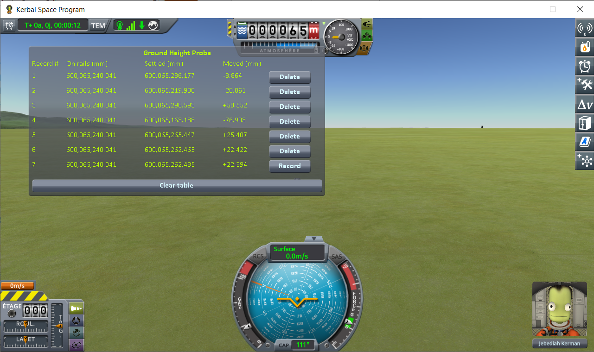
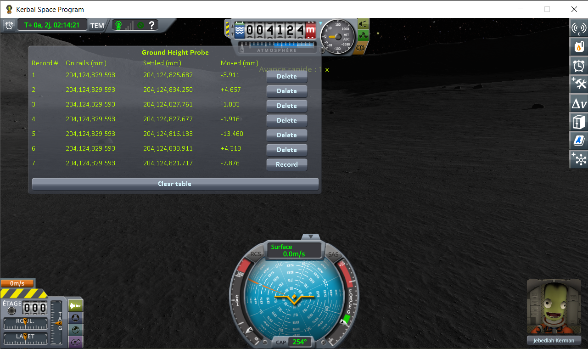
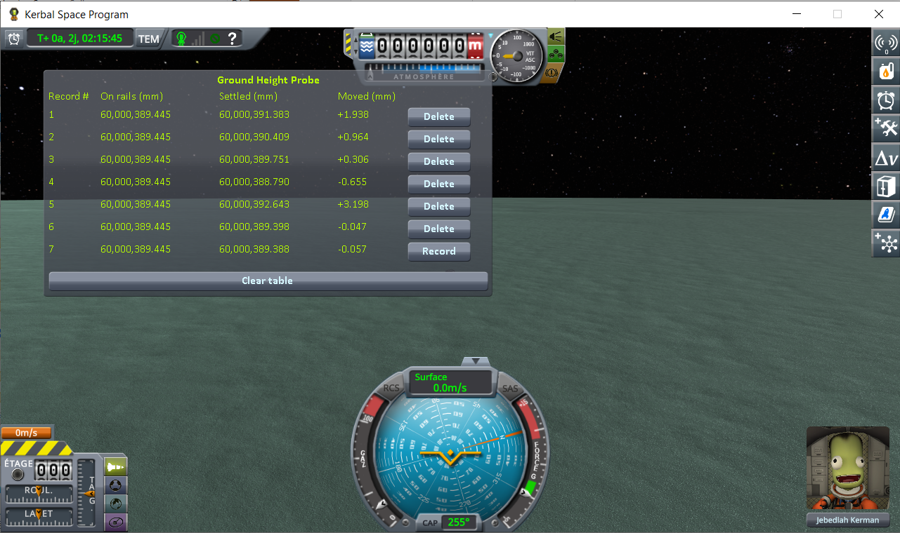
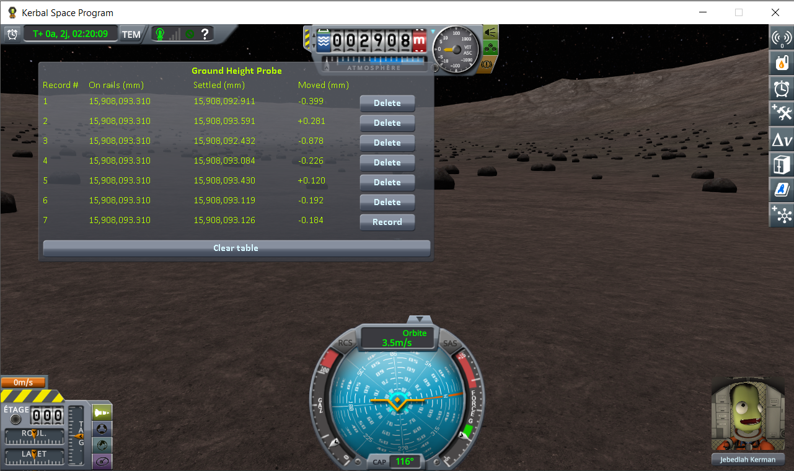
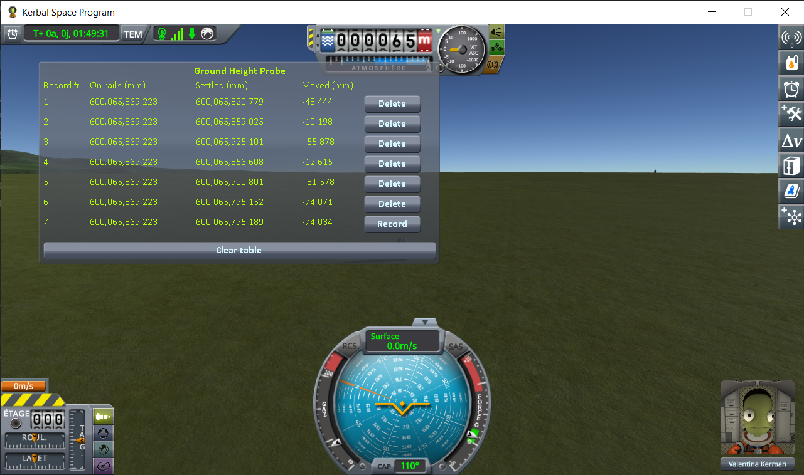
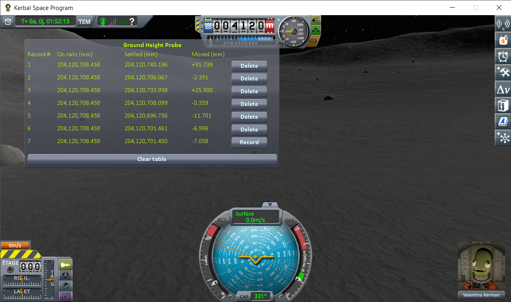
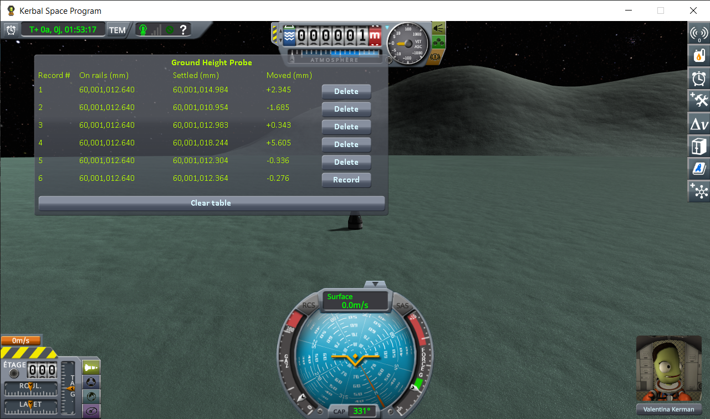
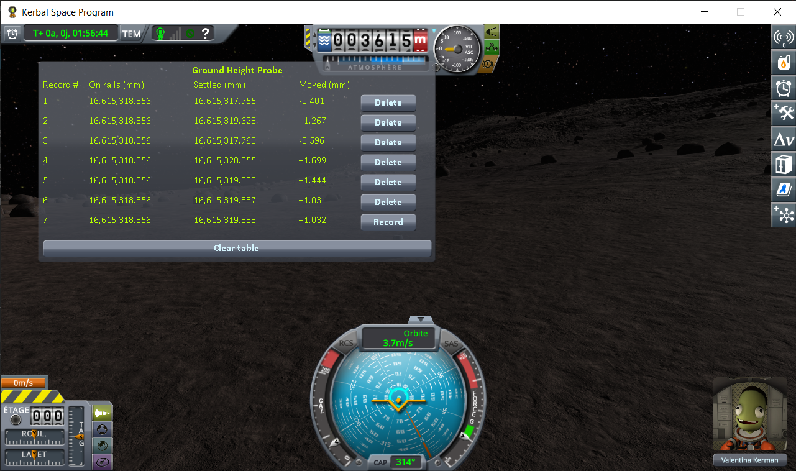

# The measurements: loading the same save

Part of [Terrain Precision Fix Diag 1](../README.md): the readings taken with
[the loading protocol](the-protocol-loading.md), on four worlds, on a stock install. The other series,
taken without loading anything, is in
[The measurements: coming back to a craft you left](the-measurements-approach.md).

Every reading on this page was taken on a **stock install**, with nothing added to `GameData` but
this mod. There is no mod conflict to look for and nothing to uninstall: this is what KSP does on its
own. Most players do have [KSP Community Fixes](https://github.com/KSPModdingLibs/KSPCommunityFixes)
installed, so the whole campaign was run a second time in an install that has it — same worlds, same
craft, same protocol. It changes nothing: the spread is of the same order on every world. Those
screenshots are in [`imgs/kspcf`](../imgs/kspcf) if you want to see them, but the tables below stay on
the stock readings on purpose: a measurement meant to show what bare KSP does is worth more taken
where nothing else is installed.

## One capsule

That is the whole demonstration, and it fits in one screenshot. Here is the same save, on the flat
grass just off the end of the runway, loaded six times:

(The bottom line is the loading in progress, not a seventh one: after the sixth *Record*, it keeps
showing that same sixth loading, still live. It carries `--` instead of a number, since it is not a
record until you freeze it. The screenshots on this page were taken before it did, and still show a
number there.)

The same value in **On rails**, six times over: KSP handed the capsule back in exactly the same
place, every single time. Never a zero in **Moved**: on all six, the ground turned out to be
somewhere else. Sometimes lower, and the capsule dropped onto it; sometimes higher, and it got pushed
back out.

The same lone capsule, the same loadings of one save, done again on the Mun, on Minmus and on
Gilly — the smallest place there is to stand on:

| loading | Kerbin — **Moved** (mm) | Mun — **Moved** (mm) | Minmus — **Moved** (mm) | Gilly — **Moved** (mm) |
|---|---|---|---|---|
| 1 | −3.864 | −3.911 | +1.938 | −0.399 |
| 2 | −20.061 | +4.657 | +0.964 | +0.281 |
| 3 | +58.552 | −1.833 | +0.306 | −0.878 |
| 4 | −76.903 | −1.916 | −0.655 | −0.226 |
| 5 | +25.407 | −13.460 | +3.198 | +0.120 |
| 6 | +22.422 | +4.318 | −0.047 | −0.192 |
| **lowest to highest** | **135.5 mm** | **18.1 mm** | **3.9 mm** | **1.2 mm** |

**On rails** gives the same digits on every line of a series, and you do not have to take the probe's
word for it. It is exactly the radius of the body plus the altitude the save file records for the
craft — the `alt` line of its `VESSEL` node in the `.sfs`:

| world | radius | `alt` in the save | radius + `alt` | **On rails** |
|---|---|---|---|---|
| Kerbin | 600,000 m | 65.240040919510648 m | 600,065,240.041 mm | 600,065,240.041 mm |
| Mun | 200,000 m | 4124.8295934277121 m | 204,124,829.593 mm | 204,124,829.593 mm |
| Minmus | 60,000 m | 0.389444850567088 m | 60,000,389.445 mm | 60,000,389.445 mm |
| Gilly | 13,000 m | 2908.093310114733 m | 15,908,093.310 mm | 15,908,093.310 mm |

So on every world KSP handed the capsule back exactly where the save says it was, and on every world
it still came to rest at a height that changed from one loading to the next.

## The same craft, with two parts

A craft made of a single part is a special case for KSP (see [the protocol](the-protocol-loading.md)). So the
whole campaign was run again with a two-part craft: the same capsule, sitting on a small flat fuel tank.

| loading | Kerbin — **Moved** (mm) | Mun — **Moved** (mm) | Minmus — **Moved** (mm) | Gilly — **Moved** (mm) |
|---|---|---|---|---|
| 1 | −48.444 | +31.739 | +2.345 | −0.401 |
| 2 | −10.198 | −2.391 | −1.685 | +1.267 |
| 3 | +55.878 | +25.500 | +0.343 | −0.596 |
| 4 | −12.615 | −0.359 | +5.605 | +1.699 |
| 5 | +31.578 | −11.701 | −0.336 | +1.444 |
| 6 | −74.071 | −6.996 | | +1.031 |
| **lowest to highest** | **129.9 mm** | **43.4 mm** | **7.3 mm** | **2.3 mm** |

**On rails** again matched the radius of the body plus the `alt` of the save, to the last digit, on
all four worlds. One part or two, the picture is the same.

