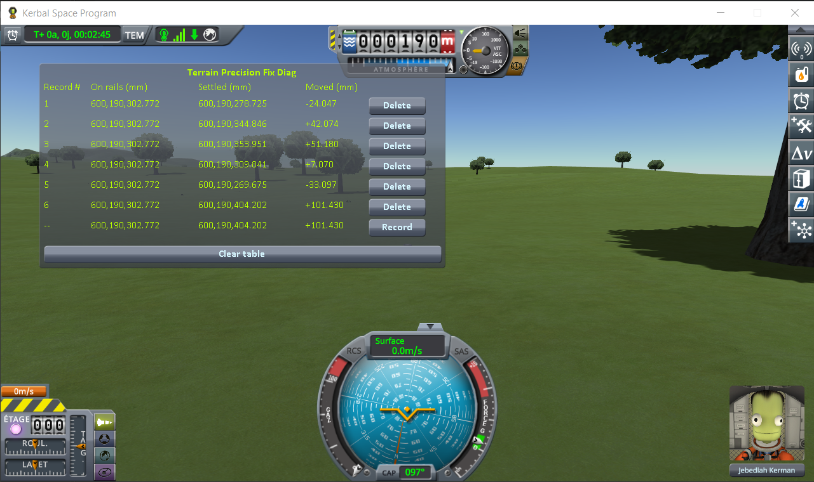
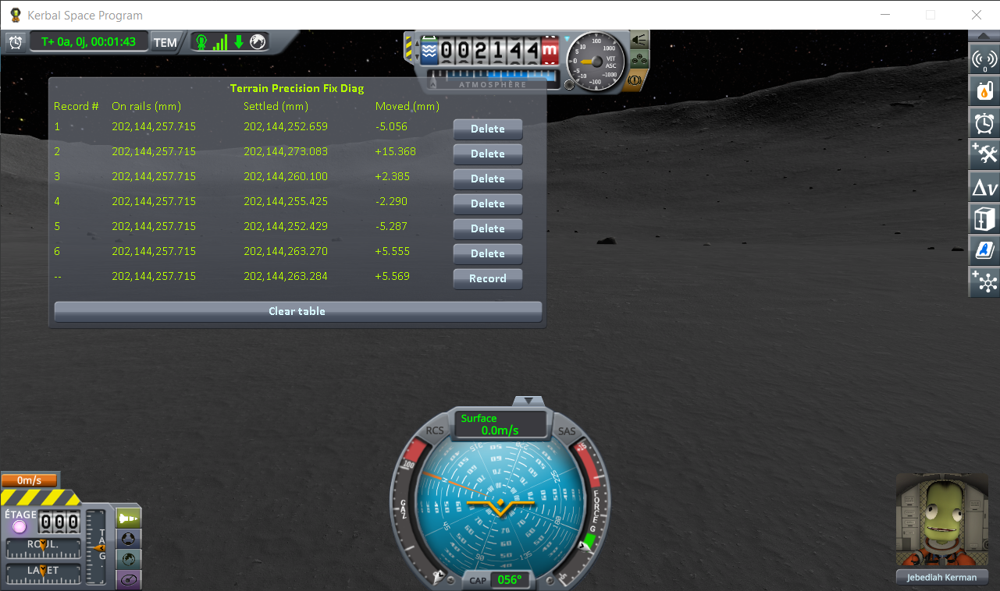
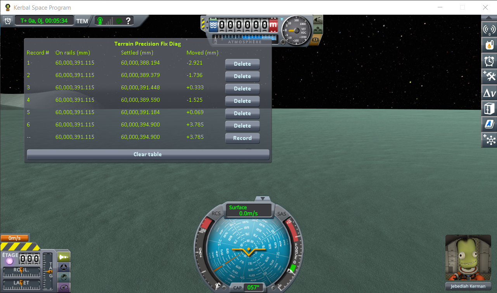
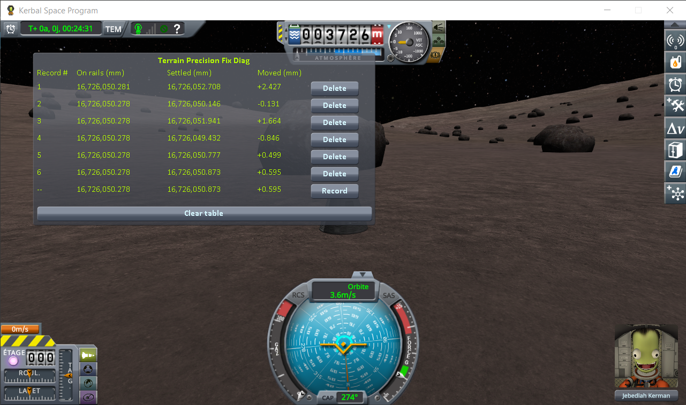
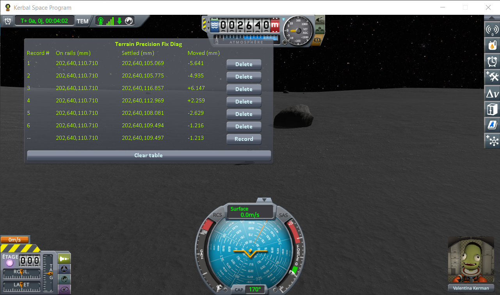
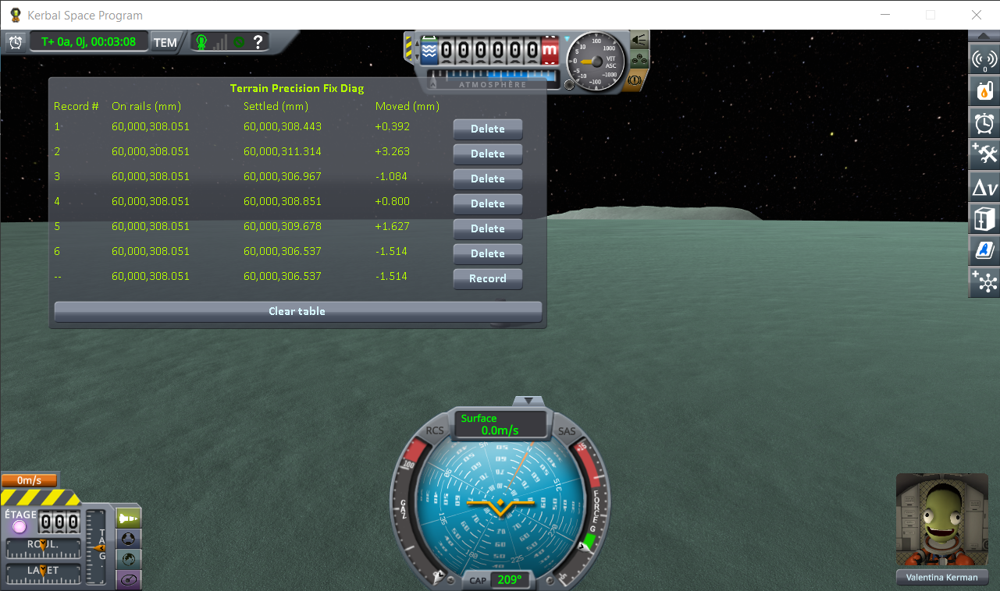
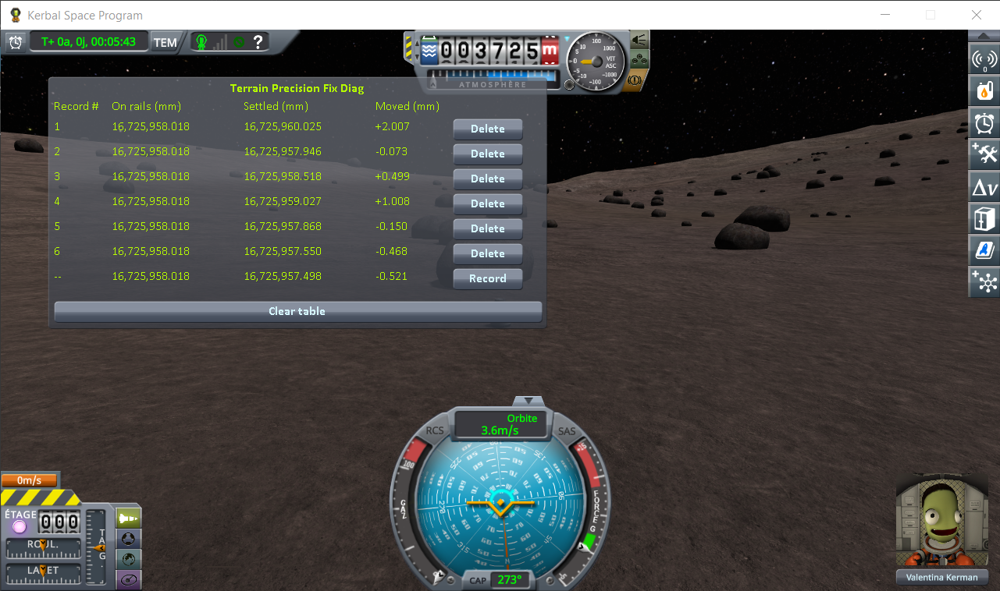
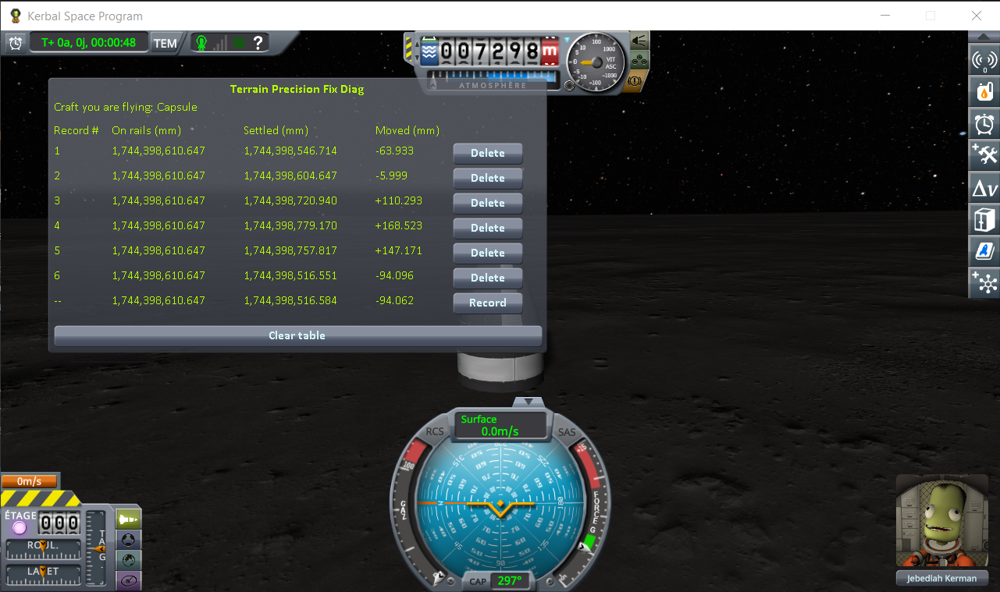
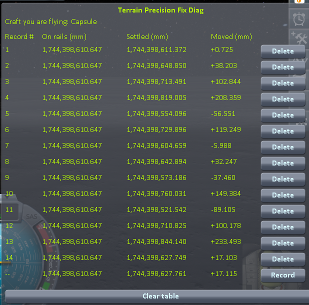
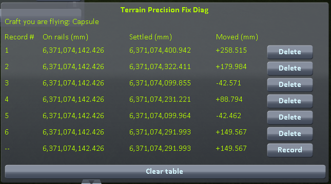

# The measurements: loading the same save

Part of [Terrain Precision Fix Diag 1](../README.md): the readings taken with
[the loading protocol](the-protocol-loading.md), on four worlds, then on two much larger ones. The other series are in
[The measurements: coming back to a craft you left](the-measurements-approach.md) and
[The measurements: switching to a craft far away](the-measurements-switching.md).

## The install

KSP 1.12.5 on Windows, with `GameData` holding Harmony, ModuleManager,
[KSP Community Fixes](https://github.com/KSPModdingLibs/KSPCommunityFixes) 1.41.1 and this mod, and
nothing else — what most players run, give or take their other mods.

## One capsule

That is the whole demonstration, and it fits in one screenshot. Here is the same save, on Kerbin,
loaded six times:

The bottom line is the loading in progress, not a seventh one: after the sixth *Record*, it keeps
showing that same sixth loading, still live.

The same value in **On rails**, six times over: KSP handed the capsule back in exactly the same
place, every single time. Never a zero in **Moved**: on all six, the ground turned out to be
somewhere else. Sometimes lower, and the capsule dropped onto it; sometimes higher, and it got pushed
back out.

The same lone capsule, the same loadings of one save, done again on the Mun, on Minmus and on
Gilly — the smallest place there is to stand on:

| loading | Kerbin — **Moved** (mm) | Mun — **Moved** (mm) | Minmus — **Moved** (mm) | Gilly — **Moved** (mm) |
|---|---|---|---|---|
| 1 | −24.047 | −5.056 | −2.921 | +2.427 |
| 2 | +42.074 | +15.368 | −1.736 | −0.131 |
| 3 | +51.180 | +2.385 | +0.333 | +1.664 |
| 4 | +7.070 | −2.290 | −1.525 | −0.846 |
| 5 | −33.097 | −5.287 | +0.069 | +0.499 |
| 6 | +101.430 | +5.555 | +3.785 | +0.595 |
| **lowest to highest** | **134.5 mm** | **20.7 mm** | **6.7 mm** | **3.3 mm** |

## The same craft, with two parts

A craft made of a single part is a special case for KSP (see [the protocol](the-protocol-loading.md)).
So the whole campaign was run again with a two-part craft: the same capsule, sitting on a small flat
fuel tank.

| loading | Kerbin — **Moved** (mm) | Mun — **Moved** (mm) | Minmus — **Moved** (mm) | Gilly — **Moved** (mm) |
|---|---|---|---|---|
| 1 | +76.134 | −5.641 | +0.392 | +2.007 |
| 2 | +77.214 | −4.935 | +3.263 | −0.073 |
| 3 | −25.810 | +6.147 | −1.084 | +0.499 |
| 4 | +56.322 | +2.259 | +0.800 | +1.008 |
| 5 | −1.187 | −2.629 | +1.627 | −0.150 |
| 6 | −47.450 | −1.216 | −1.514 | −0.468 |
| **lowest to highest** | **124.7 mm** | **11.8 mm** | **4.8 mm** | **2.5 mm** |

## On Real Solar System

The same two-part craft, on two bodies of [Real Solar System](https://github.com/KSP-RO/RealSolarSystem),
a mod that replaces the planets with the real ones: the Moon, more than three times the radius of
Kerbin, and Earth, more than ten times.

**The install.** The one above, plus Real Solar System 20.1.3.0 and what it requires (Kopernicus,
Modular Flight Integrator, KSPTextureLoader, the RSS textures), on an install of its own. The saves
are in [`diag`](../diag/README.md#on-real-solar-system); they only load there.

**Real Solar System already moves landed craft at loading.** It ships a component,
`VesselGroundPositionEnhancer`, which runs the stock repositioning pass on every landed craft it
unpacks: a craft found more than 10 cm off the ground is moved onto it before its physics starts, and
`KSP.log` gets a `Moving Vessel` line. The protocol asks for loadings without such a line; on Real
Solar System they cannot all be avoided, so every line below says whether the craft was moved. Under
10 cm, the pass leaves the craft where it is. The component turns itself off when an assembly named
`WorldStabilizer` is loaded.

### The Moon

Six loadings of `reload-moon-rss.sfs`:

| loading | **Moved** (mm) | in `KSP.log` |
|---|---|---|
| 1 | −63.933 | |
| 2 | −5.999 | |
| 3 | +110.293 | `Moving Vessel up 0.111m` |
| 4 | +168.523 | `Moving Vessel up 0.169m` |
| 5 | +147.171 | `Moving Vessel up 0.147m` |
| 6 | −94.096 | |
| **lowest to highest** | **262.6 mm** | |

Then the same save, loaded again and again, watching the craft rather than the numbers — fourteen
loadings, all recorded:

| loading | **Moved** (mm) | what the craft did |
|---|---|---|
| 1 | +0.725 | nothing |
| 2 | +38.203 | **jumped** |
| 3 | +102.844 | moved up by the pass (`0.103m`) |
| 4 | +208.359 | moved up by the pass (`0.209m`) |
| 5 | −56.551 | nothing |
| 6 | +119.249 | moved up by the pass (`0.120m`) |
| 7 | −5.988 | nothing |
| 8 | +32.247 | **jumped** |
| 9 | −37.460 | nothing |
| 10 | +149.384 | moved up by the pass (`0.150m`) |
| 11 | −89.105 | nothing |
| 12 | +100.178 | moved up by the pass (`0.101m`) |
| 13 | +233.493 | moved up by the pass (`0.234m`) |
| 14 | +17.103 | **jumped** |
| **lowest to highest** | **322.6 mm** | |

With the component turned off, by an empty assembly named `WorldStabilizer` in `GameData`, the first
loading of the same save was enough:

### Earth

Six loadings of `reload-earth-rss-resave.sfs`, a craft parked on the grass about 1.4 km west of the KSC.
There, the craft is in the *prelaunch* situation, where Real Solar System's component does not run; the
stock pass ran on its own at three of the loadings.

| loading | **Moved** (mm) | what the craft did |
|---|---|---|
| 1 | +258.515 | moved up by the pass (`0.259m`) |
| 2 | +179.984 | moved up by the pass (`0.180m`) |
| 3 | −42.571 | nothing |
| 4 | +88.794 | **jumped** |
| 5 | −42.462 | nothing |
| 6 | +149.567 | moved up by the pass (`0.150m`) |
| **lowest to highest** | **301.1 mm** | |

The sessions are logged in [`diag/runs`](../diag/README.md#on-real-solar-system).

## What the numbers say

**On rails** gives the same digits on every line of every series, on the six bodies, with two exceptions
of a few thousandths of a millimetre: with one part, the first loading on Gilly reads three thousandths
above the five others; with two parts, the first loading on Kerbin reads two thousandths below. So
everywhere, KSP handed the craft back where the save says it was.

**Settled** did not come back once. On every body, the craft came to rest at a height that changed from
one loading to the next, and the larger the world, the larger the spread: 3.3 mm on Gilly, 6.7 mm on
Minmus, 20.7 mm on the Mun, 134.5 mm on Kerbin with one part (2.5 to 124.7 mm with two, the same
picture), then 262.6 to 322.6 mm on the Moon of Real Solar System and 301.1 mm on its Earth. Smaller
world, smaller spread, but never none.

**On the large worlds, the spread is enough to make a craft jump, and the Moved column shows when.** It sorts
every loading into one of three cases. Wherever the ground came back more than 10 cm higher, the craft
found itself that deep inside it, and the repositioning pass moved it up before its physics started:
nothing was seen to move. Wherever the ground came back lower, the craft dropped onto it. And in
between — the ground a few centimetres higher, the craft that far inside it, under the 10 cm the pass
acts on — the physics engine pushed it out: four jumps in the twenty loadings watched for them, and,
with the pass turned off, a craft tipped over at the first loading. On the four worlds of stock KSP,
the protocol keeps to loadings where the pass never runs, so only the last two cases appear there.

**Real Solar System's component is indispensable, and it is not enough.** Indispensable: over the twenty
loadings of `reload-moon-rss.sfs`, it moved the craft nine times, each time from 10 to 23 cm inside the
ground; with it turned off, the very first loading tipped the craft over. Not enough: it only acts beyond
10 cm, while on the Moon the ground comes back over 26 to 32 cm from one loading to the next, which
leaves plenty of room below it — three of the fourteen loadings watched still made the craft jump. And
where it does act, it does not put the craft back where it was saved: it moves the whole of it up, in
one block, onto a ground that came back somewhere else.
