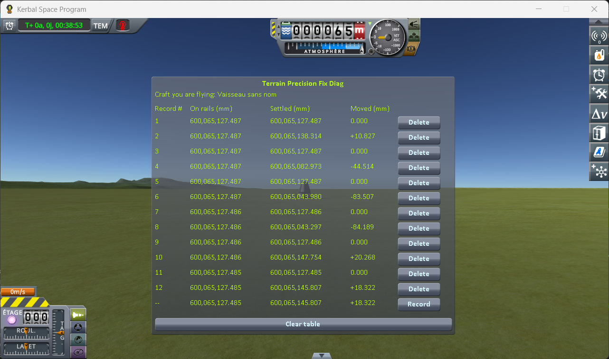

# The measurements: switching to a craft far away

Part of [Terrain Precision Fix Diag 1](../README.md): the readings taken with
[the switching protocol](the-protocol-switching.md) — a capsule and a rover landed 1.97 km apart, the
save loaded while flying the rover, then the game's *switch vessel* key pressed to fly the capsule.
The other series are in [The measurements: loading the same save](the-measurements-loading.md) and
[The measurements: coming back to a craft you left](the-measurements-approach.md).

The save the protocol uses is [`diag/switch-kerbin.sfs`](../diag/switch-kerbin.sfs), and
[the protocol page](the-protocol-switching.md#the-save) says what it holds.

## The install

KSP 1.12.5 on Windows, with `GameData` holding Harmony, ModuleManager,
[KSP Community Fixes](https://github.com/KSPModdingLibs/KSPCommunityFixes) 1.41.1 and this mod, and
nothing else.

## The readings

Six rounds, two lines each: the first recorded as the save opens, flying the rover, the second a few
seconds after switching to the capsule. The bottom line of the screenshot is the reading in progress,
not a record.

| round | **On rails** (mm) | **Settled** after the switch (mm) | **Moved** |
|---|---|---|---|
| 1 | 600,065,127.487 | 600,065,138.314 | **+10.827 mm** |
| 2 | 600,065,127.487 | 600,065,082.973 | **−44.514 mm** |
| 3 | 600,065,127.487 | 600,065,043.980 | **−83.507 mm** |
| 4 | 600,065,127.486 | 600,065,043.297 | **−84.189 mm** |
| 5 | 600,065,127.486 | 600,065,147.754 | **+20.268 mm** |
| 6 | 600,065,127.485 | 600,065,145.807 | **+18.322 mm** |
| **lowest to highest** | **0.002 mm** | **104.5 mm** | |

The first line of every round, recorded as the save opens, reads `0.000` in *Moved*: the capsule is
still held where the save put it, with nothing to move it yet.

## What these readings show

**The game hands the capsule back at the same height every time.** Across the six loadings, *On
rails* never moves by more than two thousandths of a millimetre.

**What it comes to rest on is somewhere else every time.** Once the switch hands it over to physics,
it settles between 84.2 mm lower and 20.3 mm higher: 104.5 mm from the lowest to the highest, both
upwards and downwards.

Which way it goes means no more here than in [the loading series](the-measurements-loading.md): the
reference is the height the save was made at, and the save was made on one ground among all those the
game can build there.

As everywhere else with this instrument, what is measured is **the craft**, not the ground it rests
on — [what this instrument shows, and what it does not](what-this-instrument-shows.md) applies
to these readings word for word.

## The logs

[`diag/runs/switching-stock.log`](../diag/runs/switching-stock.log) — the `KSP.log` of the session
the six rounds were taken in. Before them, it also holds rounds taken from an earlier save, since
replaced by the one above.
