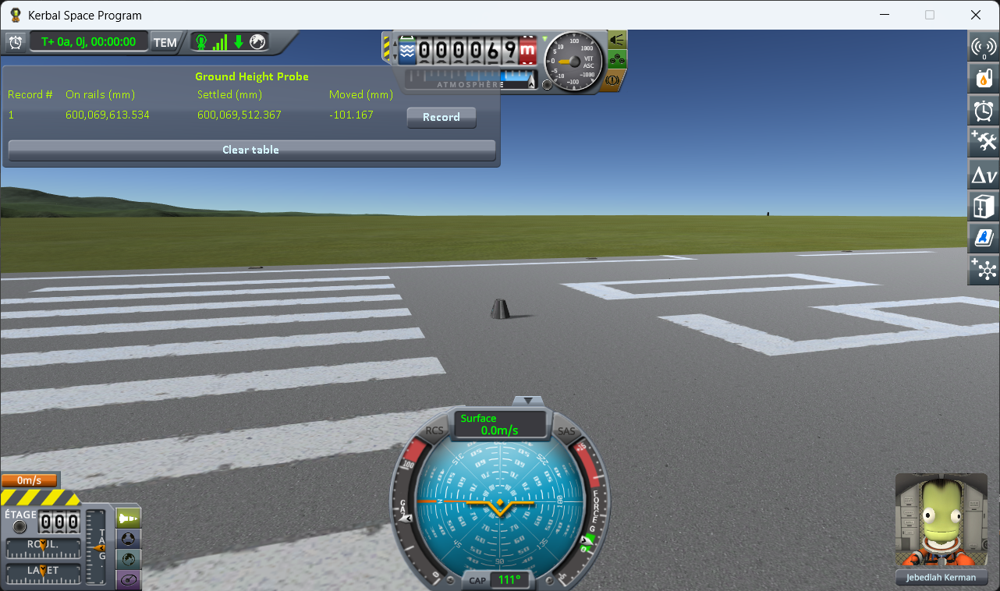
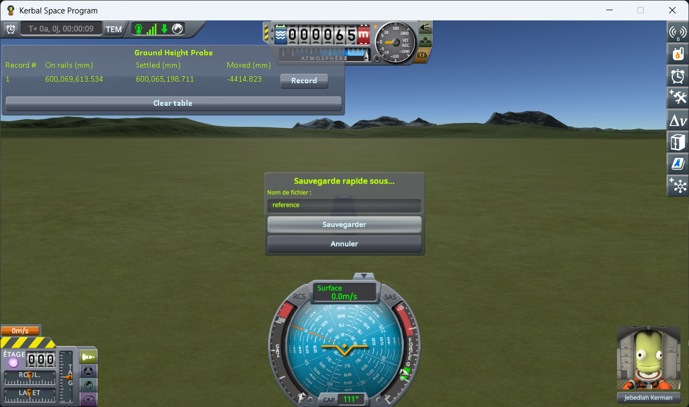
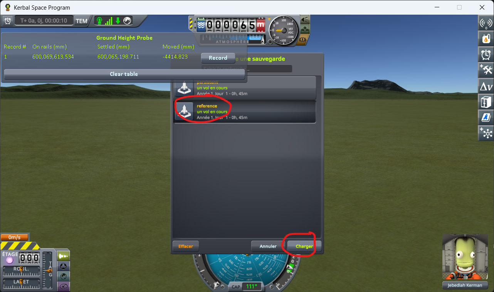
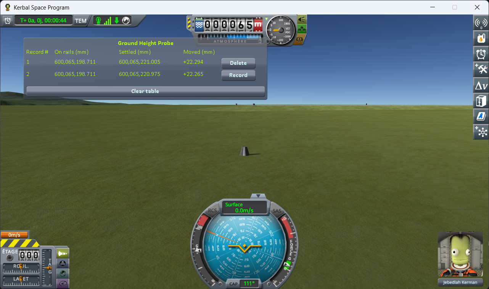
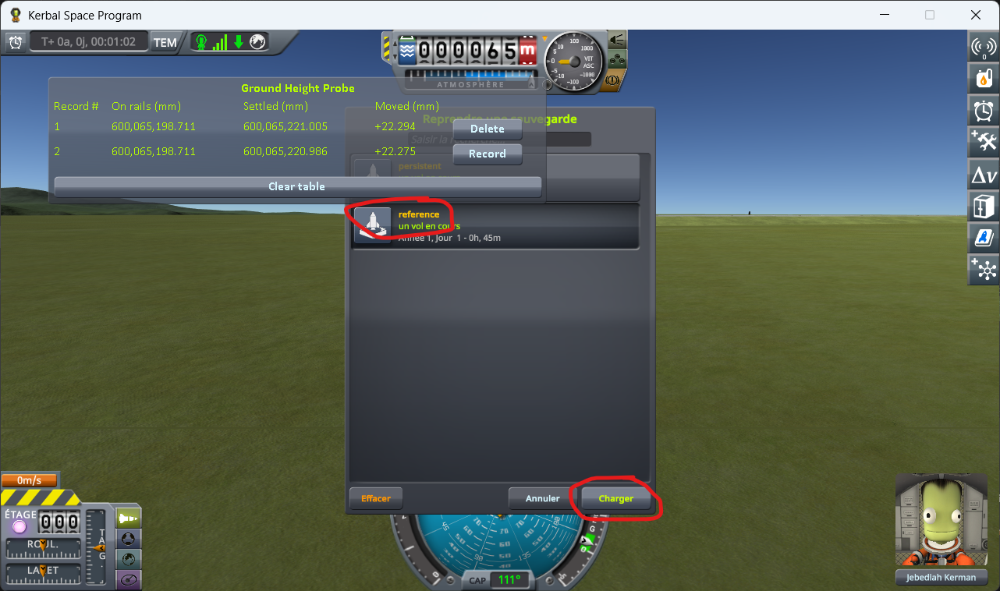
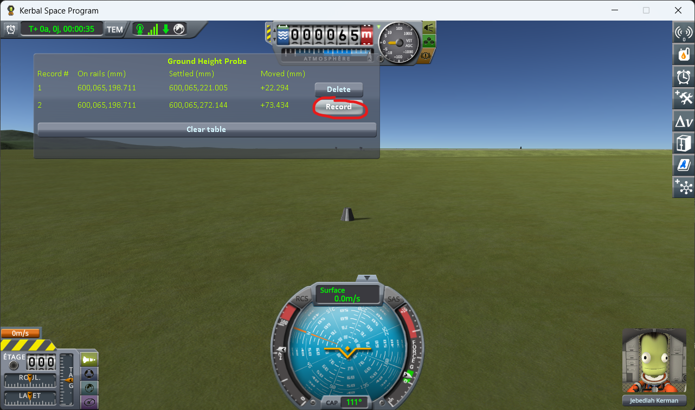

# The protocol: loading the same save

Part of [Terrain Precision Fix Diag 1](../README.md): how to take the reading on a craft that comes
back with a save, step by step. The columns it fills are in [The window](the-window.md), and what it
reads is in [The measurements: loading the same save](the-measurements-loading.md).

The other protocol takes the same reading on a craft that never comes back with a save:
[The protocol: coming back to a craft you left](the-protocol-approach.md).

**1. Launch a capsule on its own** — no anchor, no wheels, no landing legs, nothing attached.

(The probe window is draggable — drop it wherever it does not get in the way.)

**2. Move it off onto bare ground.** `Alt+F12 → Cheats → Set Position`. Tick *Use middle click to set
position*, then middle-click a patch of grass just off the end of the runway. No need to go far — the
KSC apron is conveniently flat — but you do have to be off the tarmac itself.

⚠️ **Not on the launchpad and not on the runway.** It works there too — the numbers move just the
same. The trouble is that they no longer say what moved. The launchpad and the runway are structures,
not ground: KSP puts them in place its own way, and their height may well have a wobble of its own.
A reading taken there is the sum of two effects and tells you nothing about either. On bare terrain
there is only one thing under the capsule.

⚠️ **And the ground must be flat.** A craft made of a single part is a special case for KSP: on every
loading, it tries to put the craft back onto the ground itself. On flat ground this does nothing,
and the capsule is left exactly where the save put it. On a slope KSP moves it, and the
reading then mixes that move with the ground's. You can tell from `KSP.log`: a line
`ground contact! - error. Moving Vessel` naming your capsule, right before `Unpacking`. If you get
that line, find flatter ground.

⚠️ **And the capsule must not slide.** On a slope, even one gentle enough not to produce that line,
the capsule can slide slowly downhill, and its height goes down as it slides. On a world with little
gravity like Gilly, a slope you can barely see is enough, at a fraction of a millimetre per second.
**Settled** then never stops moving, and **Moved** only tells you how long you waited before pressing
*Record*. So a spot is only good if both hold: no `Moving Vessel` line in `KSP.log`, and a **Settled**
value that stops moving once the capsule has come to rest.

**3. Let it settle, and save once.**

If you pressed *Record* before saving — out of curiosity, while placing the capsule — delete that
line now. It was taken before the save existed, so its **On rails** value is the launch position and
does not belong in the same column as the others.

**4. Load that same save.**

**5. Watch the live line until it stops moving, then press *Record* at the end of it.**

The first line appears. **On rails** is the height the save gave back, **Settled** the height the
capsule actually came to rest at, and **Moved** the difference — already not zero.

**6. Load the same save again.** Not a new save: the one from step 3, again.

**7. Settle, record again.** A second line appears, under the first.

**8. Repeat steps 6 and 7** until you have five or six lines.

⚠️ **Never save again until the campaign is over.** Saving each time would write a new position every
time, and you would be measuring your own round trip on top of the ground.

Now read the table. If there were nothing wrong, it would read like this: **On rails** the same value
on every line — KSP handing the capsule back exactly where it left it, loading after loading — and
**Moved** zero on every line, because the capsule was set down on the ground and has nothing left to
do.

Half of that holds. **On rails** comes back to within a thousandth of a millimetre, so the save and
reload round trip is exact and the capsule really is put back where it was. **Moved** is not zero on
a single line, and it is not small either.

