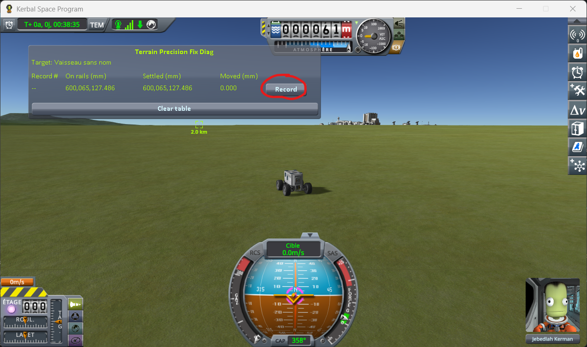
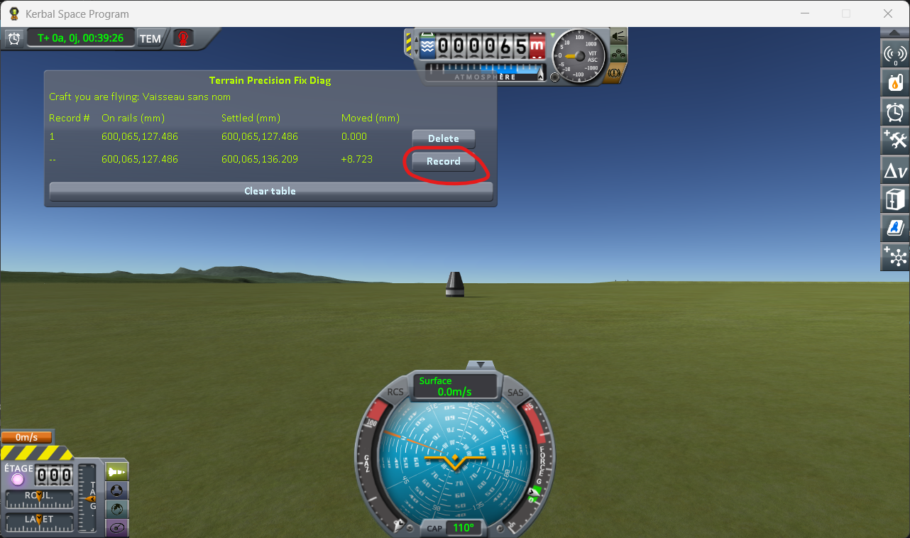

# The protocol: switching to a craft far away

Part of [Terrain Precision Fix Diag 1](../README.md): how to take the reading on a craft you switch
to, without driving anywhere. The columns it fills are in [The window](the-window.md), and what it
reads is in [The measurements: switching to a craft far away](the-measurements-switching.md).

The two other protocols take the same reading on a craft handed back by a save —
[The protocol: loading the same save](the-protocol-loading.md) — and on a craft you drive away from
and back to — [The protocol: coming back to a craft you left](the-protocol-approach.md).

Two craft are landed about two kilometres apart. You load the save while flying one of them, then
jump to the other with the game's own *switch vessel* key, and the window follows that other craft
throughout.

## The save

[`switch-kerbin.sfs`](../diag/switch-kerbin.sfs), a sandbox game of KSP 1.12.5. Copy it into the
folder of a sandbox game and load it from that game. It holds two craft, landed on the flat grass
west of the KSC, 1.97 km apart on a north–south line:

- **the craft the readings are about**: a Mk1 command pod on an FL-T100 tank, landed at latitude
  −0.1299°, longitude −74.7611°;
- **the rover**, 1.97 km to the south, at latitude −0.3180°, longitude −74.7578°. It is the craft you
  are flying when the save opens, and the capsule is already its target.

So the window follows the capsule from the moment the scene opens: as the rover's target first, then,
once you have switched to it, as the craft you are flying. You have nothing to set.

You can of course build your own two craft instead. The capsule must meet the same conditions as
[the capsule of the loading protocol](the-protocol-loading.md): flat ground, no suspension, nothing
that needs a slope to move on its own. The two craft must be more than 500 m apart, and less than
2250 m, so that the game keeps both of them loaded.

## The protocol

**1. Load the save.** You are flying the rover, and the window reads its target, the capsule. Press
*Record*.

**2. Switch to the capsule** with `]` — the game's default *switch to next vessel* key. You are now
flying it. Give it three to five seconds, then press *Record*.

**3. Load the same save again**, and repeat steps 1 and 2 — six times in all, two lines each time.

⚠️ **Do not touch the throttle of the capsule** while you are flying it. Throttling up frees a landed
craft from what holds it in place, and the next line would be measuring that.

⚠️ **Never save over the save you load.** It is what holds the height the capsule is handed back at,
and every round must start from that same height.

One round says nothing on its own: it is the series that is worth reading, not a line.
